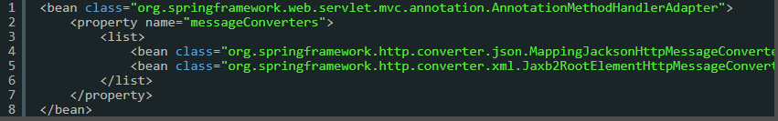

# MessageConver
: xml이나 Json을 이요한 AJAX 기능이나 Web Service를 개발할 때 사용.     
HTTP요청 프로퍼티를 모델 오브젝트의 프로퍼티에 개별적으로 바인딩 하고 모델 오브젝트를 다시 뷰를 이용해 클라이언트로 보낼 콘텐츠를 만드는 대신 HTTP 요청에 메시지 본문과 HTTP 응답 메시지 본문을 통째로 메시지로 다루는 방식

## 1. 스프링은 MessageConverter를 가지고 있다. 기본값은 현재 Json이다. ?????

1. 중간데이터 : xml, Json교체

|   |   |   ||
|---|---|---|---|
|자바 Object| ->|파이썬 Object|X|
|자바 Object| -> Json ->|파이썬 Object|O|

ex)
```
class Animal {
    int num = '0';
    String name = "사자";
}
```

-> MessageConverter -> json ->
```
{"num": 10, "name": "사자"}
```

여기서 MessageConvert의 역할은 자바 Ojbect를 전송할 때 Json으로 converting 해주는 역할

요청 이외에도 응답 받을 시에도 MessageConvert가 converting 해준다.

||||||||
|--|--|--|--|--|--|--|
|자바 프로그램|| ->| request(요청) |->|| 파이썬 프로그램|
|자바 프로그램|-> MessageConvert:Jackson |-> Json ->| request(요청) |->|| 파이썬 프로그램|
|자바 프로그램| <- || response(응답) |<- json <-| MessageConvert:Jackson <- | 파이썬 프로그램|


## 2. 스프링은 BufferedReader와 BufferedWriter를 쉽게 사용할 수 있다.

데이터 통신 -> bit단위: 0, 1, 0, 1, 0, 1

영어 한 문자는 최소 8(2^3)bit가 필요, 256가지의 문자 전송

한글은 8bit 통신불가, 최소 16bit 필요

8bit씩 끊어 읽어라, 그러면 한 문자씩 읽을 수 있을 거야,

1byte = 8bit, 1byte는 통신단위가 된다, 하나의 문자를 뜻함.

전 세계 언어들을 사용하기 위해서 unicode에서 : UTF-8로, 3byte로!

- 데이터를 보내일 때 일반적으로 byte Stream이라 부르는데 이는 1byte: bit 라고 한다.

자바프로그램에서는 데이터를 읽을 때 InputStream으로 읽는다.
Stream(byte통신)인데, 문자가 아니라 바이트 그대로 받아버림  
그리고 char(문자)로 변형해야하는데 이를 해결하기위해 
InputStreamReader으로 문자하나를 받음.  
배열은 여러개의 문자를 받는데, 배열은 크기가 정해져 있어야함.   
하지만 크기가 정해져 있으면 메모리 낭비가 심하기 때문에 이를 해결하려고 BufferedReader로 감싸서 가변길이의 문자를 받을 수 있다.     
=> (jsp) request.getReader()        
상대방이 데이터 요청시 받는 쪽에서 BufferedReader로 받아야함.       
데이터를 쓸때 도 BufferedWriter를 써야하는데, 내려쓰기 기능이 없다.         
그래도 printWriter를 대신 사용한다.

printWriter는 print(), println()을 제공,

따라서 byteStream을 통해 데이터 전송할 때 전송 단위가 문자열로 가변길이의 데이터를 쓰게 해주는 클래스.    
구현 필요없이 어노테이션(@ResponseBody) 을 제공,    
BufferedWriter가  동작  데이터를 받을 때는 @requestBody -> BufferedReader가 동작
```
@ResponseBody라고 하면, bufferedWriter가 작동,
@RequestBody라고 하면, bufferedReader가 작동
```

--------------------------------------------------------------------------------------------
--------------------------------------------------------------------------------------------

## 메시지 컨버터의 종류
사용할 메시지 컨버터는 AnnotationMethodHandlerAdapter를 통해 등록

1. ByteArrayHttpMessageConverter

- 지원하는 오브젝트 타입: byte[]
- @RequestBody로 `전달` 받을 때 모든 종류의 HTTP 요청 메시지 본문을 byte 배열로 가져올 수 있음
- @ResponseBody로 `보낼` 때는 Content-Type: application/octet-stream으로 설정
- 컨트롤러가 byte 배열에 담긴 바이너리 정보를 클라이언트에 전송할 필요가 있을 때 외에는 유용X
- 바이너리 포맷을 가진 정보를 주고 받아야 하는 시스템이 있다면 활용

2. StringHttpMessageConverter

- 지원하는 Object Type: String
- HTTP 요청의 본문을 그대로 String으로 가져 올 수 있음
- HTTP는 기본적으로 text. 가공하지 않은 본문을 직접 받아서 사용하고 싶은 경우라면 유용하게 사용 가능.
- XML이나 Json 같은 공개된 형식 외에 직접 정의한 문서 포멧이 있다면 적절한 Parser를 붙여서 활용할 수 있도록 문자열로 받는 것이 편리하다.
- 더 나은 방법은 HttpMessageConverter를 직접 개발 적용한다.
- 응답의 경우는 ContentType이 text/plain으로 전달된다. 단순 문자열로 응답을 보내고 싶을 때 @ResponseBody와 함께 스트링 리턴 값을 사용하면 된다.

3. FormHttpMessageConverter

- Media Type이 application/x-www-form-urlencoded로 정의된 폼 data를 주고 받을 때 사용.
- Ojbect type: 다중 값을 갖는 Map 확장 인터페이스인 MultiValueMap<String, String>을 지원
- MultiValueMap은 Map의 값이 List 타입인 Map으로 `하나의 이름을 가진 여러 개의 파라미터가 사용` 될 수 있는 HTTP 요청 파라미터를 처리하기에 적당하다.
- @ModelAttribute를 이용하여 바인딩 하는 것이 훨씬 편리

4. SourceHttpMessageConverter

- MediaType: application/xml, application/*+xml, text/xml 세가지를 지원
- Object Type: javax.xml.transform.Source 타입인 DOMSource, SAXSource, StreamSrouce 세가지를 지원한다.
- XML문서를 Source 타입의 오브젝트를 전환하고 싶을 때 유용하게 쓸 수 있다.
- 최근에는 OXM 기술의 발달로 XML을 자바 오브젝트로 변환하는 경우가 많기 때문에 그다지 많이 쓰이지는 않겠지만, DOM이나 SAX 방식의 XML 문서 접근을 선호한다면 이용할 만하다.
- 기본적으로 네 가지 종류의 HttpMessageConverter가 디폴트로 등록되지만, 이 보다는 디폴트로 등록되지 않는 다음 세가지 HttpMessageConverter가 실제로 더 유요하다.
- 이중에서 필요한 메시지 컨버터가 있다면 AnnotaionMethodHandlerAdapter 빈의 messageConverters 프로퍼티에 등록하고 사용해야한다.

> 아래 세가지는 `자주 사용되고 유용한 컨버터`

5. Jaxb2RootElementHttpMessageConverter

- JAXB2의 @XmlRootElement 와 @XmlType이 붙은 클래스를 이용해서 XML 과 오브젝트 사이의 메시지 변환을 지원한다.
- 기본적으로 SourceHttpMessageConver와 동일한 XML 미디어 타입을 지원한다.
- 오브젝트는 두 가지 어노테이션 중 하나가 적용됐다면 어떤 타입이든 사용할 수 있다.
- JAXB2의 스키마 컴파일러를 통해 생성된 바인딩용 클래스를 이용해서 손쉽게 XML과 오브젝트 사이의 변환 기능을 이용할 수 있다.
- JAXB2에 숙련된 개발자라면 이를 이용해 편리하게 XML 문서 기반의 컨트롤러를 만들 수 있다.

6. MarshallingHttpMessageConverter

- 스프링의 OXM 추상화의 Marshaller 와 Unmarshaller를 이용해서 XML 문서와 자바 오브젝트 사이의 변환을 지원해주는 컨버터
- MarshallingHttpMessageConverter를 빈으로 등록할 때 프로퍼티에 marshaller와 unmarshaller를 선정해줘야 한다.
- 미디어 타입은 다른 XML 기반 메시지 컨버터와 동일하다.
- 지원 오브젝트는 unmarshaller의 supports() 메소드를 호출해서 판단한다.
- OXM 기술을 자유롭게 선택해서 XML문서 기반의 컨트롤러를 작성하려고 한다면 편리하게 이용.   
(단, Marshaller의 갯수 만큼 MarshallingHttpMessageConverter를 등록해줘야 하는것이 단점.)

7. MappdingJacsonHttpMessageConverter

- Jackson ObjectMapper를 이요해서 자바 오브젝트와 JSON문서를 자동 변환해주는 메시지 컨버터
- 지원 미디어 타입은 application/json이다.
- 자바 오브젝트 타입에 제한은 없지만 프로퍼티를 가진 자바빈 스트링이거나 HashMap을 이용해야 정확한 변환 결과를 얻을 수 있다.
- Jackson 프로젝트의 ObjectMapper가 대부분의 자바 타입을 무난히 Json으로 변환해주지만 날짜나 숫자 등에서 포맷을 적용하는 등의 부가적인 변환 기능이 필요하다면 ObjectMapper를 확장해서 적용할 수 있다.
- 스프링 소스가 제공하는 [MVC-AJAX 예제 프로젝트](https://src.springsource.org/svn/spring-samples/mvc-ajax/trunk) 를 보면, 스프링의 컨버전 서비스를 JSON 변환에 적용하도록 ObjectMapper 를 확장한 예를 찾아 볼 수 있다.
- 위의 세 가지 메시지 컨버터를 사용하려면 다음과 같이 AnnotationMethodHandler 빈을 등록하고, messageconverters 프로퍼티에 등록해줘야 한다. 여타 전략과 마찬가지로 전략 프로퍼티를 직접 등록하면 디폴트 전략은 자동으로 추가되지 않는다는 점을 주의!

