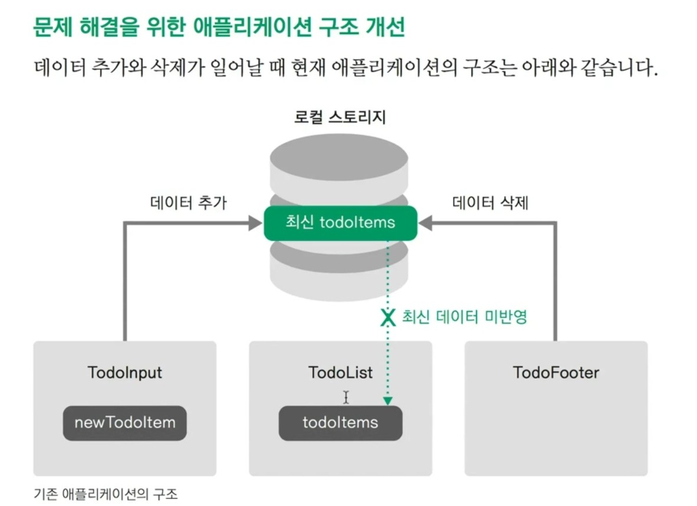
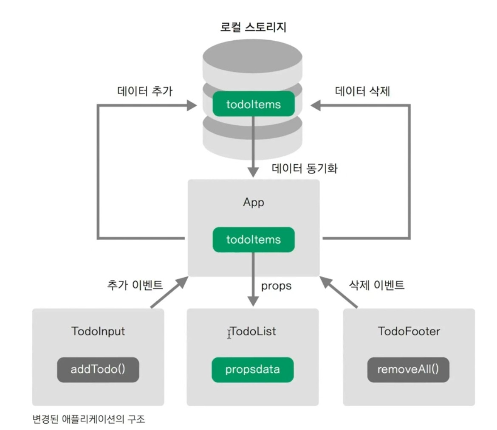

# Vue
1. nodejs 설치(설치하면 npm 사용 가능)
```cmd
> node -v

> npm -v

```
2. vue cli 설치
```js
npm i -g @vue/cli
```

3. vue 프로젝트 생성
```js
vue create 프로젝이름 이름
vue 버전 2 선택(default)
```
4. 프로젝트 생성후 실행해보기
```js
cd 프로젝트이름
npm run dev(or yarn run serve)
```

5. 컴포넌트 파일 만들기
```js
components 폴더에

TodoHeader.vue
TodoInput.vue
TodoList.vue
TodoFooter.vue

만들기
```

6. App.vue 컴포넌트 등록
```js
<template>
    <div id="app">
        <TodoHeader></TodoHeader>
        <TodoInput></TodoInput>
        <TodoList></TodoList>
        <TodoFooter></TodoFooter>
    </div>
</template>

<script>
    import TodoHeader from './components/TodoHeader.vue'
    import TodoInput from './components/TodoInput.vue'
    import TodoList from './components/TodoList.vue'
    import TodoFooter from './components/TodoFooter.vue'

    export default {
    components: {
    'TodoHeader': TodoHeader,
    'TodoInput': TodoInput,
    'TodoList': TodoList,
    'TodoFooter': TodoFooter
}
}
</script>

<style>
    body {
    text-align: center;
    background-color: #F6F6F6;
}
    input {
    border-style: groove;
    width: 200px;
}
    button {
    border-style: groove;
}
    .shadow {
    box-shadow: 5px 10px 10px rgba(0, 0, 0, 0.03);
}
</style>
```
7. 파이콘, 아이콘, 폰트 반응형 태그 설정

`index.html`
```html
<meta name="viewport" content="width=device-width, initial-scale="1.0">
```
<br>

1) favicon
```html
<link rel="shortcut icon" href="src/assets/favicon.ico" type="image/x-icon">
<link rel="icon" href="src/assets/favicon.ico" type="image/x-icon">
```
2) 아이콘

```
<link rel="stylesheet" href="https://pro.fontawesome.com/releases/v5.10.0/css/all.css" integrity="sha384-AYmEC3Yw5cVb3ZcuHtOA93w35dYTsvhLPVnYs9eStHfGJvOvKxVfELGroGkvsg+p" crossorigin="anonymous"/>
```
3) 폰트

```style
<style>
@import url('https://fonts.googleapis.com/css2?family=Itim&display=swap');

html, body {
font-family: 'Itim', cursive;
}
#app {
font-family: 'Itim', cursive;
}
</style>
```

9. TodoHeader

`TodoHeader.vue`

```vue
<template>
  <header>
    <h1>Todo it!</h1>
  </header>
</template>

<style scoped>
h1 {
  color: #2F3B52;
  font-weight: 900;
  margin: 2.5rem 0 1.5rem;
}
</style>
```

11. TodoInput

1) input form 생성

`TodoInput.vue`

```vue
<template>
  <div>
      <input type="text" v-model="newTodoItem">
  </div>
</template>

<script>
export default {
  data: function() {
    return {
      newTodoItem: ""
    }
  }
}
</script>
```

2) v-model에 있는 내용을 저장

버튼을 생성
```vue
<template>
  <div>
      <input type="text" v-model="newTodoItem">
      <button v-on:click="addTodo">add</button>
  </div>
</template>

<script>
export default {
  data: function() {
    return {
      newTodoItem: ""
    }
  },
  methods: {
    addTodo: function() {
      console.log(this.newTodoItem);
      //저장하는 로직
      localStorage.setItem(this.newTodoItem, this.newTodoItem);
      this.newTodoItem=""; //비워주기(초기화)

    }
  }
}
</script>
```

3) 코드 정리, 스타일 추가

버튼 태그를 빼고 span과 i로 바꾸기

`TodoInput.vue`

```vue
<template>
  <div class="inputBox shadow">
      <input type="text" v-model="newTodoItem" v-on:keyup.enter="addTodo">
      <span class="addContainer" v-on:click="addTodo">
        <i class="far fa-plus-square addBtn"></i>
      </span>
  </div>
</template>

<script>
export default {
  data: function() {
    return {
      newTodoItem: ""
    }
  },
  methods: {
    addTodo: function() {
      console.log(this.newTodoItem);
      //저장하는 로직
      localStorage.setItem(this.newTodoItem, this.newTodoItem);
      this.clearInput();
    },
    clearInput: function() {
      this.newTodoItem=""; //비워주기(초기화)
    }
  }
}
</script>

<style scoped>
input:focus {
  outline: none;
}
.inputBox {
  background: white;
  height: 50px;
  line-height: 50px;
  border-radius: 5px;
}
.inputBox input {
  border-style: none;
  font-size: 0.9rem;
}
.addContainer {
  float: right;
  background: linear-gradient(to right, #62EAC6, #32CEE6);
  display: block;
  width: 3rem;
  border-radius: 0 5px 5px 0;
}
.addBtn {
  color: white;
  vertical-align: middle;
}
</style>
```

4) 엔터를 눌러도 추가 되는 기능

```vue
<input type="text" v-model="newTodoItem" v-on:keyup.enter="addTodo">
```

12. TodoList

`TodoList.vue`

```vue
<script>
export default {
  data: function() {
    return {
      todoItems: []
    }
  },
  created: function() {
    if (localStorage.length > 0) {
      for (var i = 0; i < localStorage.length; i ++) {
        if (localStorage.key(i) !== 'loglevel:webpack-dev-server') {
          this.todoItems.push(localStorage.key(i));
        }
      }
    }
  }
}
</script>

<style scoped>
ul {
  list-style-type: none;
  padding-left: 0;
  margin-top: 0;
  text-align: left;
}
li {
  display: flex;
  min-height: 50px;
  height: 50px;
  line-height: 50px;
  margin: 0.5rem 0;
  padding: 0 0.9rem;
  background: white;
  border-radius: 5px;
}
</style>
```

1) 자동으로 list생성

localStorage에 저장된 todoItem의 개수만큼 자동으로 list 생성

```vue
<template>
  <div>
    <ul>
      <li v-for="todoItem in todoItems" v-bind:key="todoItem">
        {{ todoItem }}
      </li>
    </ul>
  </div>
</template>
```

2) 삭제 버튼 생성

```vue
<template>
  <div>
    <ul>
      <li v-for="(todoItem, index) in todoItems" v-bind:key="todoItem" class="shadow">
        {{ todoItem }}
        <span class="removeBtn" v-on:click="removeTodo(todoItem, index)">
          <i class="fas fa-trash-alt"></i>
        </span>
      </li>
    </ul>
  </div>
</template>

<style>
.checkBtn {
  line-height: 45px;
  color: #62acde;
  margin-right: 5px;
}
.checkBtnCompleted {
  color: #b3adad;
}
.textCompleted {
  text-decoration: line-through;
  color: #b3adad;
}
.removeBtn {
  margin-left: auto;
  color: #de4343;
}
</style>
```

3) 삭제 기능 추가

```vue
<script>
export default {
  data: function() {
    return {
      todoItems: []
    }
  },
  methods: {
    removeTodo: function(todoItem, index) {
      localStorage.removeItem(todoItem);
      this.todoItems.splice(index, 1); //특정 index에서 하나를 지울 수 있음
    }
  },
  created: function() {
    if (localStorage.length > 0) {
      for (var i = 0; i < localStorage.length; i ++) {
        if (localStorage.key(i) !== 'loglevel:webpack-dev-server') {
          this.todoItems.push(localStorage.key(i));
        }
      }
    }
  }
}
</script>
```

13. TodoFooter

`TodoFooter.vue`

```vue
<template>
  <div class="clearAllContainer">
      <span class="clearAllBtn" v-on:click="clearTodo">Clear All
      </span>
  </div>
</template>

<script>
export default {
  methods: {
    clearTodo: function() {
      localStorage.clear();
    }
  }
}
</script>

<style scoped>
.clearAllContainer {
  width: 8.5rem;
  height: 50px;
  line-height: 50px;
  background-color: white;
  border-radius: 5px;
  margin: 0 auto;
}
.clearAllBtn {
  color: #e20303;
  display: block;
}
</style>
```
14. 체크박스 기능 구현

체크를 클릭하면 글자색이 변하고 취소선이 생성

1) 클릭 svg 추가

`TodoInput.vue`

```vue
<template>
  <div class="inputBox shadow">
      <input type="text" v-model="newTodoItem" v-on:keyup.enter="addTodo">
      <!-- <button v-on:click="addTodo">add</button> -->
      <span class="addContainer" v-on:click="addTodo">
        <i class="fas fa-plus addBtn" aria-hidden="true"></i>
      </span>
  </div>
</template>
```

2) 클릭 boolean 저장

클릭이 됐는지 알기 위해 (텍스트, 텍스트) 가 아닌 (텍스트, 불린)을 저장

```vue
<script>
export default {
  data: function() {
    return {
      newTodoItem: ''
    }
  },
  methods: {
    addTodo: function() {
      if (this.newTodoItem !== '') {
        var obj = {completed: false, item: this.newTodoItem};
        //(텍스트,텍스트) 가 아닌 (텍스트, 불린) 을 저장
        localStorage.setItem(this.newTodoItem, JSON.stringify(obj));
        this.clearInput();
      }
    },
    clearInput: function() {
      this.newTodoItem= ''; //비워주기(초기화)
    }
  }
}
</script>
```

## 현재 애플리케이션 구조의 문제점


각각의 컴포넌트에서만 사용할 수 있는 뷰 데이터 속성 `(newTodoItem, Todoitems)`을 갖고 있습니다.<br>
만약 모든 컴포넌트가 `'같은 데이터 속성`을 조작한다면 화면을 매번 새로고침해야하는 문제점이 발생합니다.<br>
같은 데이터 속성을 사용하기 위해 최상위(루트) 컴포넌트인 `App` 컴포넌트에 todoItems라는 데이터를 정의하고 (App을 컨테이너처럼 생각), 하위 컴포넌트 `TodoList`에 `props로 전달
<br><br>

<br>

14. 할일 목록 표시 기능

1) App.vue가 생성되자마자 배열을 담을 수 있도록 `TodoList.vue` -> `App.vue`로 옮김

`App.vue`

```vue
<template>
  <div id="app">
<!--    <TodoList></TodoList>-->
    <!-- <TodoList v-bind:내려보낼 프롭스 속성이름="현재 위치의 컴포넌트 데이터 속성"></TodoList> -->
    <TodoList v-bind:propsdata="todoItems"></TodoList>
  </div>
</template>

<script>
export default {
  data: function() { //옮김
    return {
      todoItems: []
    }
  },
  created: function() { //옮김
    if (localStorage.length > 0) {
      for (var i = 0; i < localStorage.length; i++) {
        if (localStorage.key(i) !== 'loglevel:webpack-dev-server') {
          this.todoItems.push(JSON.parse(localStorage.getItem(localStorage.key(i))));
        }
      }
    }
  },
  components: {
    'TodoHeader': TodoHeader,
    'TodoInput': TodoInput,
    'TodoList': TodoList,
    'TodoFooter': TodoFooter
  }
}
</script>
```

2) TodoList로 데이터를 내려보내기 위한 propsdata 생성

`TodoList.vue`

```vue
<template>
  <section>
    <ul>
      <li v-for="(todoItem, index) in propsdata" class="shadow" v-bind:key="todoItem.item">
      <!-- propsdata로 변경 -->
...생략...
</template>

<script>
export default {
  props: ['propsdata'],
  methods: {
    removeTodo: function(todoItem, index) {
      this.todoItems.splice(index, 1);
      localStorage.removeItem(todoItem);
    },
    toggleComplete: function(todoItem) {
      todoItem.completed = !todoItem.completed;
      localStorage.removeItem(todoItem.item);
      localStorage.setItem(todoItem.item, JSON.stringify(todoItem));
    }
  }
}
</script>
```

원래 localhost:8080을 들어갔을 때 localstorage에 들어 있는 내용이 바로 화면에 띄워지지 않았다.
<br>
하지만 이젠 localhost:8080를 들어가자 마자 항목을 띄운다.<br>

15. 할일 추가 기능

할 일을 추가해도 화면에 바로 띄워지지 않고 새로 고침을 해야하는 문제가 발생

1) addOneItem라는 이름으로 method를 하나 생성하고

`App.vue`

```vue
<template>
  <div id="app">
    ...
    <!-- <TodoInput v-on:하위 컴포넌트에서 발생시킨 이벤트 이름="현재 컴포넌트에서 메서드 명"></TodoInput> -->
    <TodoInput v-on:addTodoItem="addOneItem"></TodoInput>    
    ...
  </div>
</template>


```

2) `TodoInput.vue` 안에 있던 내용을 `App.vue`로 옮긴다.

`App.vue`

```vue
<script>
import TodoHeader from './components/TodoHeader.vue'
import TodoInput from './components/TodoInput.vue'
import TodoList from './components/TodoList.vue'
import TodoFooter from './components/TodoFooter.vue'

export default {
  components: {
    'TodoHeader': TodoHeader,
    'TodoInput': TodoInput,
    'TodoList': TodoList,
    'TodoFooter': TodoFooter
  }
}
</script>

아래처럼 변경

<script>
import TodoHeader from './components/TodoHeader.vue'
import TodoInput from './components/TodoInput.vue'
import TodoList from './components/TodoList.vue'
import TodoFooter from './components/TodoFooter.vue'

export default {
  data: function() {
    return {
      newTodoItem: ''
    }
  },
  methods: {
    addOneItem: function(todoItem) {
      var obj = {completed: false, item: todoItem};
      localStorage.setItem(todoItem, JSON.stringify(obj));
      this.todoItems.push(obj);
    }
  },
  created: function() {
    if (localStorage.length > 0) {
      for (var i = 0; i < localStorage.length; i++) {
        if (localStorage.key(i) !== 'loglevel:webpack-dev-server') {
          this.todoItems.push(JSON.parse(localStorage.getItem(localStorage.key(i))));
        }
      }
    }
  },
  components: {
    'TodoHeader': TodoHeader,
    'TodoInput': TodoInput,
    'TodoList': TodoList,
    'TodoFooter': TodoFooter
  }
}
</script>
```

3) 맨 위 코드에서 `하위 컴포넌트에서 발생시킨 이벤트 이름`을 `addTodoItem` 이라고 명명하고,<Br>
`TodoInput.vue`의 메서드 내용을 다음과 같이 매칭

`TodoInput.vue`

```vue
<script>
export default {
  data: function() {
    return {
      newTodoItem: ''
    }
  },
  methods: {
    addTodo: function() {
      if (this.newTodoItem !== '') {
        var obj = {completed: false, item: this.newTodoItem};
        //(텍스트,텍스트) 가 아닌 (텍스트, 불린) 을 저장
        localStorage.setItem(this.newTodoItem, JSON.stringify(obj));
        this.clearInput();
      }
    },
    clearInput: function() {
      this.newTodoItem= ''; //비워주기(초기화)
    }
  }
}
</script>

아래처럼 변경

<script>
export default {
  data: function() {
    return {
      newTodoItem: ''
    }
  },
  methods: {
    addTodo: function() {
      if (this.newTodoItem !== '') {
        // this.$emit('이벤트 이름', 인자1, 인자2, ...);
        this.$emit('addTodoItem', this.newTodoItem)
        this.clearInput();
      } else {
        this.showModal = !this.showModal;
      }
    }
  }
}
</script>
```

16. 할일 삭제 기능

`App.vue` 에서 method 내 removeOneItem 추가

```vue
<template>
  <div id="app">
    ...
    <TodoList v-bind:propsdata="todoItems" v-on:removeItem="removeOneItem"></TodoList>
    ...
  </div>
</template>

<script>
export default {
  ...,
  methods: {
    addOneItem: function(todoItem) {
    ...
    },
    // 추가
    removeOneItem: function(todoItem, index) {
      this.todoItems.splice(index, 1); //특정 index에서 하나를 지울 수 있음
      localStorage.removeItem(todoItem.item);
    }
  },
  ...
</script>
```

`TodoList.vue` 에서 `App.vue`로 옮기는 코드

```vue
this.todoItems.splice(index, 1); //특정 index에서 하나를 지울 수 있음
localStorage.removeItem(todoItem);
```

`TodoList.vue` 

```vue
<script>
export default {
  props: ['propsdata'],
  methods: {
    removeTodo: function(todoItem, index) {
      this.$emit('removeItem', todoItem, index);
    }
  }
}
</script>
```

이제는 휴지통 버튼을 누르면 localstorage에서 내용이 삭제되고 화면에서도 삭제된다.

17. 할일 완료 기능

`TodoList.vue` 에서 App.vue 로 옮길 코드

```vue
todoItem.completed = !todoItem.completed;
localStorage.removeItem(todoItem.item);
localStorage.setItem(todoItem.item, JSON.stringify(todoItem));
```

`App.vue` 

```vue
<template>
  <div id="app">
  ...
    <!-- <TodoList v-bind:내려보낼 프롭스 속성이름="현재 위치의 컴포넌트 데이터 속성"></TodoList> -->
    <TodoList v-bind:propsdata="todoItems" v-on:removeItem="removeOneItem" v-on:toggleItem="toggleOneItem"></TodoList>
    <TodoFooter></TodoFooter>
  </div>
</template>

<script>
export default {
  ...,
  methods: {
    addOneItem: function(todoItem) {
      ...
    },
    removeOneItem: function(todoItem, index) {
      ...
    },
    toggleOneItem: function(todoItem, index) {
      //todoItem.completed = !todoItem.completed;
      this.todoItems[index].completed = !this.todoItems[index].completed;
      localStorage.removeItem(todoItem.item);
      localStorage.setItem(todoItem.item, JSON.stringify(todoItem));
    }
  },
  ...
}
</script>
```

`TodoList.vue`

```vue
<script>
export default {
  ...,
  methods: {
    removeTodo: function(todoItem, index) { 
      ...
    },
    toggleComplete: function(todoItem) {
      this.$emit('toggleEvent', todoItem);
    }
  }
}
</script>
```
18. 할일 모두 삭제 기능

`TodoFooter.vue` 에서 App.vue로 옮길 코드
```vue
localStorage.claer();
```

`App.vue`

```vue
<script>
export default {
  ...,
  methods: {
    addOneItem: function(todoItem) {
    ...
    },
    removeOneItem: function(todoItem, index) {
    ...
    },
    toggleOneItem: function(todoItem, index) {
    ...
    },
    clearAllItems: function() {
      localStorage.clear();
      this.todoItems = []; //다시 빈 배열로 만들기
    }
  },
  ...
}
</script>
```

`TodoFooter.vue`

```vue
<script>
export default {
  methods: {
    clearTodo: function() {
      this.$emit('clearAll');
    }
  }
}
</script>
```

19. 모달 컴포넌트 등록

[모달 컴포넌트 예제 사이트](https://kr.vuejs.org/v2/examples/modal.html)

> /src/components/common 폴더 생성<br>
> Modal.vue 생성

`TodoInput.vue`

```vue
<template>
  ...
      <Modal v-if="showModal" @close="showModal = false">
      <!--
       you can use custom content here to overwrite
        default content
     -->
      	<h3 slot="header">custom header</h3>
      </Modal>
  </div>
</template>

<script>
import Modal from './common/Modal'

...

export default {
  data: function() {
    return {
      newTodoItem: '',
      showModal: false
    }
  },
  methods: {
    addTodo: function() {
    ...},
    clearInput: function() {
    ...},
    components: {
      Modal: Modal
    }
  }
</script>
```

20. 모달 컴포넌트의 slot

어떠한것도 적지 않고 추가 버튼을 누르면 뜸

`TodoInput.vue`

1) header 관련코드 복사붙이고 변경하고 확인
```vue
<template>
...
      <Modal v-if="showModal" @close="showModal = false">
        <h3 slot="header">
          경고!
        </h3>
      </Modal>
</template>

<script>
import Modal from './common/Modal'

export default {
  data: function() {
    return {
      newTodoItem: '',
      showModal: false
    }
  },
  methods: {
    addTodo: function() {
      if (this.newTodoItem !== '') {
        this.$emit('addTodoItem', this.newTodoItem)
        this.clearInput();
      } else {
        this.showModal = !this.showModal;
      }
    },
...

</script>
```

2) 같은 방식으로 body와 footer 변경

```vue
<Modal v-if="showModal" @close="showModal = false">
        <h3 slot="header">
          Caution!
        </h3>
        <h3 slot="body">
          Empty strings are not allowed.
        </h3>
        <h3 slot="footer">
          © genie
        </h3>
      </Modal>
```

3) `x` 이미지를 하나 넣어 클릭 시 modal 창 닫게 만들기

```vue
<h3 slot="header">
    Caution!
    <i class="fas fa-times closeModalBtn" @click="showModal = false"></i>
</h3>

<style>
...
.closeModalBtn {
  color: #42b983;
}
...
</style>
```

21. 트랜지션 소개

List가 추가되고 삭제될 때, 부드럽게 나타나게 만들기.

[트랜지션 예제 코드 사이트](https://kr.vuejs.org/v2/guide/transitions.html)

`TodoList.vue`

```vue
<template>
  <div>
    <transition-group name="list" tag="p">
    ...
    </transition-group>
</template>
```

스타일 추가

```vue
/* 리스트 아이템 트랜지션 효과 */
.list-enter-active, .list-leave-active {
  transition: all 1s;
}
.list-enter, .list-leave-to {
  opacity: 0;
  transform: translateY(30px);
}
```

# 완성
1. TodoHeader
```vue
<template>
  <header>
    <h1>Todo it!</h1>
  </header>
</template>

<style scoped>
h1 {
  color: #2F3B52;
  font-weight: 900;
  margin: 2.5rem 0 1.5rem;
}
</style>
```

2. TodoInput
```vue
<template>
  <div class="inputBox shadow">
    <input type="text" v-model="newTodoItem" v-on:keyup.enter="addTodo">
    <!-- <button v-on:click="addTodo">add</button> -->
    <span class="addContainer" v-on:click="addTodo">
        <i class="fas fa-plus addBtn" aria-hidden="true"></i>
    </span>
    <Modal v-if="showModal" @close="showModal = false">
      <h3 slot="header">
        Caution!
        <i class="fas fa-times closeModalBtn" @click="showModal = false"></i>
      </h3>
      <h3 slot="body">
        Empty strings are not allowed.
      </h3>
      <h3 slot="footer">
        © kimmjen
      </h3>
    </Modal>
  </div>
</template>

<script>
import Modal from './common/Modal';

export default {
  data: function() {
    return {
      newTodoItem: '',
      showModal: false
    }
  },
  methods: {
    addTodo: function() {
      if (this.newTodoItem !== '') {
        // this.$emit('이벤트 이름', 인자1, 인자2, ...);
        this.$emit('addTodoItem', this.newTodoItem)
        this.clearInput();
      } else {
        this.showModal = !this.showModal;
      }
    },
    clearInput: function() {
      this.newTodoItem= ''; //비워주기(초기화)
    }
  },
  components: {
    Modal: Modal
  }
}
</script>

<style scoped>
input:focus {
  outline: none;
}

.inputBox {
  background: white;
  height: 50px;
  line-height: 50px;
  border-radius: 5px;
}

.inputBox input {
  border-style: none;
  font-size: 0.9rem;
}

.addContainer {
  float: right;
  background: linear-gradient(to right, #62EAC6, #32CEE6);
  display: block;
  width: 3rem;
  border-radius: 0 5px 5px 0;
}

.addBtn {
  color: white;
  vertical-align: middle;
}
/**/
.closeModalBtn {
  color: #42b983;
}
</style>
```

3. TodoList
```vue
<template>
  <div>
    <transition-group name="list" tag="p">
      <li v-for="(todoItem, index) in propsdata" class="shadow" v-bind:key="todoItem.item">
        <i class="checkBtn fas fa-check" v-bind:class="{checkBtnCompleted: todoItem.completed}" v-on:click="toggleComplete(todoItem, index)"></i>
        <span v-bind:class="{textCompleted: todoItem.completed}">{{ todoItem.item }}</span>
        <span class="removeBtn" v-on:click="removeTodo(todoItem, index)">
          <i class="removeBtn fas fa-trash-alt"></i>
        </span>
      </li>
    </transition-group>
  </div>
</template>

<script>
export default {
  props: ['propsdata'],
  methods: {
    removeTodo: function(todoItem, index) {
      this.$emit('removeItem', todoItem, index);
    },
    toggleComplete: function(todoItem) {
      this.$emit('toggleEvent', todoItem);
    }
  }
}
</script>

<style scoped>
/**/
ul {
  list-style-type: none;
  padding-left: 0;
  margin-top: 0;
  text-align: left;
}
li {
  display: flex;
  min-height: 50px;
  height: 50px;
  line-height: 50px;
  margin: 0.5rem 0;
  padding: 0 0.9rem;
  background: white;
  border-radius: 5px;
}
/**/
.checkBtn {
  line-height: 45px;
  color: #62acde;
  margin-right: 5px;
}
.checkBtnCompleted {
  color: #b3adad;
}
.textCompleted {
  text-decoration: line-through;
  color: #b3adad;
}
.removeBtn {
  margin-left: auto;
  color: #de4343;
}
/**/
/* 리스트 아이템 트랜지션 효과 */
.list-enter-active, .list-leave-active {
  transition: all 1s;
}
.list-enter, .list-leave-to {
  opacity: 0;
  transform: translateY(30px);
}
</style>
```

4. TodoFooter
```vue
<template>
  <div class="clearAllContainer">
    <span class="clearAllBtn" v-on:click="clearTodo">Clear All</span>
  </div>
</template>

<script>
export default {
  methods: {
    clearTodo: function() {
      this.$emit('clearAll');
    }
  }
}
</script>

<style scoped>
.clearAllContainer {
  width: 8.5rem;
  height: 50px;
  line-height: 50px;
  background-color: white;
  border-radius: 5px;
  margin: 0 auto;
}
.clearAllBtn {
  color: #e20303;
  display: block;
}
</style>
```
5. Modal
```vue
<template>
  <transition name="modal">
    <div class="modal-mask">
      <div class="modal-wrapper">
        <div class="modal-container">

          <div class="modal-header">
            <slot name="header">
              default header
            </slot>
          </div>

          <div class="modal-body">
            <slot name="body">
              default body
            </slot>
          </div>

          <div class="modal-footer">
            <slot name="footer">
              default footer
              <button class="modal-default-button" @click="$emit('close')">
                OK
              </button>
            </slot>
          </div>
        </div>
      </div>
    </div>
  </transition>
</template>

<style>
.modal-mask {
  position: fixed;
  z-index: 9998;
  top: 0;
  left: 0;
  width: 100%;
  height: 100%;
  background-color: rgba(0, 0, 0, .5);
  display: table;
  transition: opacity .3s ease;
}
.modal-wrapper {
  display: table-cell;
  vertical-align: middle;
}
.modal-container {
  width: 300px;
  margin: 0px auto;
  padding: 20px 30px;
  background-color: #fff;
  border-radius: 2px;
  box-shadow: 0 2px 8px rgba(0, 0, 0, .33);
  transition: all .3s ease;
  font-family: Helvetica, Arial, sans-serif;
}
.modal-header h3 {
  margin-top: 0;
  color: #42b983;
}
.modal-body {
  margin: 20px 0;
}
.modal-default-button {
  float: right;
}
/*
 * The following styles are auto-applied to elements with
 * transition="modal" when their visibility is toggled
 * by Vue.js.
 *
 * You can easily play with the modal transition by editing
 * these styles.
 */
.modal-enter {
  opacity: 0;
}
.modal-leave-active {
  opacity: 0;
}
.modal-enter .modal-container,
.modal-leave-active .modal-container {
  -webkit-transform: scale(1.1);
  transform: scale(1.1);
}
</style>
```
6. App
```vue
<template>
  <div id="app">
    <TodoHeader></TodoHeader>
    <!-- <TodoInput v-on:하위 컴포넌트에서 발생시킨 이벤트 이름="현재 컴포넌트에서 메서드 명"></TodoInput> -->
    <TodoInput v-on:addTodoItem="addOneItem"></TodoInput>
    <!-- <TodoList v-bind:내려보낼 프롭스 속성이름="현재 위치의 컴포넌트 데이터 속성"></TodoList> -->
    <TodoList v-bind:propsdata="todoItems" v-on:removeItem="removeOneItem" v-on:toggleItem="toggleOneItem"></TodoList>
    <TodoFooter v-on:clearAll="clearAllItems"></TodoFooter>
  </div>
</template>

<script>
import TodoHeader from './components/TodoHeader.vue'
import TodoInput from './components/TodoInput.vue'
import TodoList from './components/TodoList.vue'
import TodoFooter from './components/TodoFooter.vue'

export default {
  data: function() {
    return {
      todoItems: []
    }
  },
  methods: {
    addOneItem: function(todoItem) {
      var obj = {completed: false, item: todoItem};
      localStorage.setItem(todoItem, JSON.stringify(obj));
      this.todoItems.push(obj);
    },
    removeOneItem: function(todoItem, index) {
      this.todoItems.splice(index, 1); //특정 index에서 하나를 지울 수 있음
      localStorage.removeItem(todoItem.item);
    },
    toggleOneItem: function(todoItem, index) {
      //todoItem.completed = !todoItem.completed;
      this.todoItems[index].completed = !this.todoItems[index].completed;
      localStorage.removeItem(todoItem.item);
      localStorage.setItem(todoItem.item, JSON.stringify(todoItem));
    },
    clearAllItems: function() {
      localStorage.clear();
      this.todoItems = []; //다시 빈 배열로 만들기
    }
  },
  created: function() {
    if (localStorage.length > 0) {
      for (var i = 0; i < localStorage.length; i++) {
        if (localStorage.key(i) !== 'loglevel:webpack-dev-server') {
          this.todoItems.push(JSON.parse(localStorage.getItem(localStorage.key(i))));
        }
      }
    }
  },
  components: {
    'TodoHeader': TodoHeader,
    'TodoInput': TodoInput,
    'TodoList': TodoList,
    'TodoFooter': TodoFooter
  }
}
</script>

<style>
@import url('https://fonts.googleapis.com/css2?family=Itim&display=swap');

html, body, #app {
  font-family: 'Itim', cursive;
}
body {
  text-align: center;
  background-color: #F6F6F6;
}
input {
  border-style: groove;
  width: 200px;
}
button {
  border-style: groove;
}
.shadow {
  box-shadow: 5px 10px 10px rgba(0, 0, 0, 0.03);
}
</style>
```
7. index.html
```html
<!DOCTYPE html>
<html lang="en">
<head>
    <meta charset="UTF-8">
    <meta http-equiv="X-UA-Compatible" content="IE=edge">
    <meta name="viewport" content="width=device-width, initial-scale=1.0">
    <title>vue-todo</title>
    <link rel="shortcut icon" href="src/assets/favicon.ico" type="image/x-icon">
    <link rel="icon" href="src/assets/favicon.ico" type="image/x-icon">
    <link rel="preconnect" href="https://fonts.gstatic.com">
    <link rel="stylesheet" href="https://pro.fontawesome.com/releases/v5.10.0/css/all.css" integrity="sha384-AYmEC3Yw5cVb3ZcuHtOA93w35dYTsvhLPVnYs9eStHfGJvOvKxVfELGroGkvsg+p" crossorigin="anonymous"/>
</head>
<body>
<div id="app"></div>
</body>
</html>
```

8. main.js
```js
import Vue from 'vue'
import App from './App.vue'

Vue.config.productionTip = false

new Vue({
  render: h => h(App),
}).$mount('#app')
```

체크박스상자는 해결못했음.
