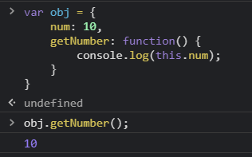

# Vue.js

1. Vue.js를 공부해야 하는 이유
2. 사전 준비
3. 강의 판교

# Vue 소개

1. MVVM 모델에서의 Vue

**Vue는 무엇인가**

컨트롤러대신 뷰 모델을 가지는 MVVM(Model-View-ViewModel) 패턴을 기반으로 디자인 되었으며. 재사용이 가능 한 UI들을 묶어서 사용

- MVVM: Mode - View - ViewModel의 줄임말로 로직과 UI의 분리를 위해 설계된 패턴
  

웹 페이지는 돔과 자바스크립트로 만들어지게 되는데 돔이 view역할을 하고, 자바스크립트가 Model 역할을 한다.<br>
뷰 모델이 없는 경우에는 직접 모델과 뷰를 연결해야한다.<br>
그러나 뷰 모델이 중간에 연결해 주는 것이 MVVM모델

MVVM 패턴의 뷰모델 레이어에 해당하는 화면 단 라이브러리

### Vue의 특징

- MVVM 패턴을 사용
- Virtual DOM의 사용
- Angular, React에 비해 매우 작고, 가벼우며 복잡도가 낮다.
- Template와 Component를 사용하여 재사용이 가능한 사용자 인터페이스를 묶고 view Layer를 정리하여 사용


2. Reactivity 구현

```vue

<div id="app"></div>
<script>
var div = document.querySelector('#app');
var viewModel = {};

// 객체의 동작을 재정의
// Object.defineProperty(대상 객체, 객체의 속성, {정의할 내용})
Object.defineProperty(viewModel, 'str', {
  // 속성에 접근했을 때의 동작을 정의
  get: function () {
    console.log('접근');
  },
  // 속성에 값을 할당했을 때의 동작을 의미
  set: function (newValue) {
    console.log('할당', newValue);
    render(newValue);
  }
})
</script>
```

3. Reactivity 코드 라이브러리화 하기

```vue
(fucntion() { // 즉시 실행 함수
function init() {
// 객체의 동작을 재정의
// Object.defineProperty(대상 객체, 객체의 속성, {정의할 내용})
Object.defineProperty(viewModel, 'str', {
// 속성에 접근했을 때의 동작을 정의
get: function() {
console.log('접근');
},
// 속성에 값을 할당했을 때의 동작을 정의
set: function(newValue) {
console.log('할당', newValue);
render(newValue);
}
});
}

function render(value) {
div.innerHTML = value;
}

init();
})();    
```

# Vue.js 인스턴스

1. 인스턴스 소개

new Vue로 선언하여 만들어진 객체로, 뷰로 개발할 때 필수로 생성해야 하는 코드이다.

```vue
new Vue();
```


2. 인스턴스와 생성자 함수

기본적인 생성자 함수의 개념<br>
<br>
매번 함수를 정의하는 게 아니라, 생성자 함수로 vue에서 api와 속성들을 정의해 놓고 갔다 쓰거나 재사용하는것
<br>=> new vue를 사용하는 이유
<br>

<br>

3. 인스턴스 옵션 속성
   <br>
   el: 태그에 지정한 ID, 클래스명, 태그명으로 해당 태그와 vue 인스턴스를 연겨하는 옵션

```vue
var vm = new Vue({
el: '#app' // element 지정해야 vue를 사용할 수 있음.
});
```

<br>
data: key와 value를 지정하는 json형식으로 데이터 입력 옵션
<br>
computed: getter/setter를 지정하는 옵션
과 같은 많은 기능이 존재

```vue
var vm = new Vue({
el: '#app',
data: {
message: 'hi'
},
methods: {
}
});
```

# Vue.js 컴포넌트

1. 컴포넌트 소개
   <br>
   화면에 비춰지는 뷰의 단위를 쪼개어 `재활용이 가능한 형태`로 관리하는 것이 컴포넌트이다.
   <br>
   vue는 재사용이 가능한 컴포넌트로 웹 페이지를 구성할 수 있따.
   <br>
   확장자가 .vue인 단일 파일에 HTML, 자바스크립트, css코드로 구성하여 사용

2. 컴포넌트 등록 실습

```vue
Vue.compoenet('컴포넌트 이름', '컴포넌트 내용');
```

- 전역 컴포넌트 등록: 실무에서 전역 컴포넌트는 거의 쓰이지 않지만 일단 이해를 위해 학습

  ```vue
    <div id="app">
    <app-header></app-header>
    <app-content></app-content>
    </div>
    
    <script>
    // 전역 컴포넌트
    // Vue.component('컴포넌트 이름', '컴포넌트 내용');
    Vue.component('app-header', {
      template: '<h1>Header</h1>'
    });
    Vue.component('app-content', {
      template: '<div>Content</div>'
    });
    
    new Vue({
      el: '#app'
    });
    </script>
  ```
  
- 지역 컴포넌트 등록
    ```vue
     <div id="app">
    <app-footer></app-footer>
    </div>
    
    <script>
    new Vue({
      el: '#app',
      components: {
        // 지역 컴포넌트 등록 방식
        //'키': '값'
        //'컴포넌트 이름': 컴포넌트 내용
        'app-footer': {
          template: '<footer>footer</footer>'
        }
      }
    });
    </script>
    ```

3. 컴포넌트와 인스턴스와의 관계
   : 새로운 인스턴스를 하나 생성

    ```vue
     <div id="app">
            <app-header></app-header>
            <app-footer></app-footer>
        </div>
        <div id="app2">
            <app-header></app-header>
            <app-footer></app-footer>
        </div>
    
        <script>
            // 전역 컴포넌트
            // Vue.component('컴포넌트 이름', '컴포넌트 내용');
            Vue.component('app-header', {
                template: '<h1>Header</h1>'
            });
        
            new Vue({
                el: '#app',
                components: {
                    // 지역 컴포넌트 등록 방식
                    //'키': '값'
                    //'컴포넌트 이름': 컴포넌트 내용
                    'app-footer': {
                        template: '<footer>footer</footer>'
                    }
                }
            });
    
            new Vue({
                el: '#app2'
            });
        </script>
    ```
   
- 전역 컴포넌트는 바로 등록 되지만, 지역 컴포넌트는 인스턴스를 생성할 때마다 코드를 작성해서 등록

# Vue.js 컴포넌트 통신 방법
1. 컴포넌트 통신

Vue.js에서 부모-자식 컴포넌트 관계는 props는 아래로, events 위로 라고 요약할 수 있다. 부모는 props를 통해 자식에게 데이터를 전달하고 자식은 events를 통해 부모에게 메시지를 보낸다.


2. props속성

사용방법
```vue
<app-header v-bind:프롭스 속성이름="상위 컴포넌트의 데이터 이름"></app-header>
```

예시
```vue
<div id="app">
    <app-header v-bind:propsdata="message"></app-header>
</div>

<script>
    var appHeader = {
        template: '<h1>Header</h1>',
        props: ['propsdata']
    }

    new Vue({
        el: '#app',
        components: {
            'app-header': appHeader
        },
        data: {
            message: 'hi'
        }
    })
</script>
```
3. event emit

버튼 클릭 이벤트

```vue
var appHeader = {
    template: '<button v-on:click="passEvent">click me</button>',
    methods: {
        passEvent: function() {
            this.$emit('pass'); //pass라는 이벤트
        }
    }
}
```

사용방법

```vue
<app-header v-on:하위 컴포넌트에서 발새한 이벤트 이름="상위 컴포넌트의 메서드 이름"></app-header>
```

예시
```vue
<div id="app">
    <app-header v-on:pass="logText"></app-header>
</div>

<script>
    var appHeader = {
        template: '<button v-on:click="passEvent">click me</button>',
        methods: {
                passEvent: function() {
                this.$emit('pass');
            }
        }
    }

    new Vue({
        el: '#app',
        components: {
            'app-header': appHeader
        },
        methods: {
            logText: function() {
                console.log('hi');
            }
        }
    });
</script>
```

4. 뷰 인스턴스에서의 this

자기자신을 가리키는 this



# Vue.js 컴포넌트 통신 방법
1. 같은 컴포넌트 레벨 간의 통신방법 구현

root 를 거친다.


```vue
<div id="app">
    <!-- <app-header v-bind:프롭스 속성 이름="상위 컴포넌트의 데이터 이름"></app-header> -->
    <app-header v-bind:propsdata="num"></app-header>
    <app-content v-on:pass="deliverNum"></app-content>
</div>

<script>
    //app header에서 app content로 10 넘기기
    var appHeader = {
        template: '<div>header</div>',
        props: ['propsdata']
    }
    var appContent = {
        template: '<div>content<button v-on:click="passNum">pass</button></div>',
        methods: {
            passNum: function() {
                this.$emit('pass', 10);
            }
        }
    }        
    new Vue({
        el: '#app',
        components: {
            'app-header': appHeader,
            'app-content': appContent
        },
        data: {
            num: 0
        },
        methods: {
            deliverNum: function(value) {
            this.num = value;
            }
        }
    })
</script>
```

# Vue.js 라우터
1. 뷰 라우터

뷰에서 싱글 페이지 애플리케이션을 구현할 때, 사용하는 라이브러리<br>
페이지 이동과 관련된 기능을 라우터로 구현

**CDN 방식 사용법**
```vue
<script src="https://unpkg.com/vue-router@3.5.1/dist/vue-router.js"></script>
```

뷰 라우터 등록 예시
```vue
<div id="app"></div>
    
<script src="https://cdn.jsdelivr.net/npm/vue/dist/vue.js"></script>
<script src="https://unpkg.com/vue-router@3.5.1/dist/vue-router.js"></script>
<script>
    // 라우터 인스턴스 생성
    var myrouter = new VueRouter({
          //라우터 옵션  
    });
    //인스턴스에 라우터 인스턴스를 등록
    new Vue({
        el: '#app',
        router: myrouter
    });
</script>
```

2. routes 속성 설명

```vue
<div id="app">
    <router-view></router-view>
</div>

<script>
var LoginComponent = {
  template: '<div>login</div>'
}
var MainComponent = {
  template: '<div>main</div>'
}

var myrouter = new VueRouter({
  // 페이지의 라우팅 정보
  routes: [
    // 로그인 페이지 정보
    {
      //페이지의 url
      path: '/login',
      // 해당 url에서 표시될 컴포넌트
      component: LoginComponent
    },
    // 메인 페이지 정보
    {
      path: '/main',
      component: MainComponent
    }
  ]
});

new Vue({
  el: '#app',
  router: myrouter
});
</script>
```
3. 링크를 이용한 페이지 이동 및 router-link 태그 설명

사용자는 url을 다 입력해서 페이지르 이동하지 않음, 화면을 클릭해서 페이지를 이동할 수 있게 해줘야 하는데 그게 바로 `<router-link>`이다.

**사용방법**
```vue
<router-link to="이동할 url"></router-link>
```

링크 생성 예시
```vue
<div id="app">
    <div>
        <router-link to="/login">Login</router-link>
        <router-link to="/main">Main</router-link>
    </div>
    <router-view></router-view>
</div>
```

**주의**
- 해당 페이지마다 뿌려질 컴포넌트는 하나 = component
- 하나의 인스턴스에 등록할 컴포넌트는 여러 개 = components

# Vue.js HTTP 통신 라이브러리 - axios
1. axios

뷰에서 권고하고 잇는 HTTP통신 라이브러리 <br>
`Promise기반`의 HTTP 통신 라이브러리<br>
상대적으로 다른 HTTP 통신 라이브러리들에 비해 문서화가 잘되어 있고 API가 다양함

**CDN 방식 사용방법**
```vue
<script src="https://unpkg.com/axios/dist/axios.min.js"></script>
```

2. axios 실습

```vue
<div id="app">
    <button v-on:click="getData">get user</button>
    <div>
        {{ users }}
    </div>
</div>

new Vue({
    el: '#app',
    data: {
      users: []
    },
    methods: {
      getData: function() {
        var vm = this;
        axios.get('https://jsonplaceholder.typicode.com/users/')
          .then(function(response) {
            console.log(response.data);
            vm.users = response.data;
          })
          .catch(function(error) {
            console.log(error);
          });
      }
    }
})
``` 

# Vue.js 템플릿 문법
1. 템플릿(Template)의 분류

뷰로 화면을 조작하는방법<br>
크게 `데이터 바인딩`과 `디렉티브`

```vue
데이터 바인딩
콧수염 괄호(Mustache Tag)

<div>{{ message }}</div>
new Vue({
    data: {
        message: 'Hello Vue.js'
    }
})
div 태그에 콧수염 괄호를 이용해 뷰 인스턴스의 message 속성을 연결하였다.
```

```vue
디렉티브
뷰를 화면의 요소로 더 쉽게 조작하기 위한 문법

<div>
  Hello <span v-if="show">Vue.js</span>
</div>
new Vue({
    data: {
        show: false
    }
})
```
2. 데이터 바인딩과 computed 속성

```vue
<div id="app">
    <p>{{ num }}</p>
    <p>{{ doubleNum }}</p>
</div>
<script>
    new Vue({
        el: '#app',
        data: {
            num: 10,
        },
    computed: {
        doubleNum: function() {
            return this.num * 2;
        }
    }
})
</script>
```
3. 뷰 디렉티브와 v-bind

    1. 기본사용법
    ```vue
    <div id="app">
        <p v-bind:id="uuid" v-bind:class="name">{{ num }}</p>
        <p>{{ doubleNum }}</p>
    </div>
    
    <script>
    new Vue({
        el: '#app',
        data: {
            num: 10,
            uuid: 'abc1234',
            name: 'text-blue'
        },
            computed: {
                doubleNum: function() {
                return this.num * 2;
                }
            }
        })
    </script>
    ```
    2. 로그인 상태 표시하기<br>
    전형적인 프로그래밍의 if ~ else
    ```vue
    <div id="app">
      <p v-bind:id="uuid" v-bind:class="name">{{ num }}</p>
      <p>{{ doubleNum }}</p>
      <div v-if="loading">
        Loading...
      </div>
      <div v-else>
          test user has been logged in
      </div>
    </div>
   
    또는
   
   <div v-show="loading">
      Loading...
   </div> 
    ``` 
   - v-if:
   `loading`의 값이 참이면 `Loading...`가 렌더링 되고 거짓이면 `test user has been logged in`가 렌더링 된다. `v-else`를 통해서 "else 블록"을 나탈낼수 있다. `v-else`는 항상 `v-if`나 `v-else-if` 뒤에 와야한다.
   - v-show:
   `v-if`와 거의 동작이 비슷, `loading`의 값이 참이면 화면에 표시
   - 차이점:
   `v-if`는 조건에 따라 컴포넌트가 실제로 `제거`되고 `생성`된다. 반면에 `v-show`는 단순히 `css`의 `display`속성만 변경

4. methods 속성과 v-on디렉티브를 이용한 키보드, 마우스 이벤트 처리 방법

**버튼에 클릭 이벤트 주기**

```vue
<div id="app">
    <!-- <button v-on:click="메서드 이름">click me</button> -->
    <button v-on:click="logText">click me</button>
</div>

<script>
    new Vue ({
        el: '#app',
        methods: {
            logText: function() {
                console.log('clicked');
            }
        }
    })
</script>
```

> 키보드 입력 이벤트 주기
```vue
<input type="text" v-on:keyup="logText">
```
> 엔터를 누를 때만 기능 실행하도록 하기
```vue
<input type="text" v-on:keyup.enter="logText">
```

# Vue.js 템플릿 문법
1. watch 속성
```vue
<script>
    new Vue({
        el: '#app',
        data: {
            num: 10
        },
        watch: {
            num: function() {
                this.logText();
            }
        },
        methods: {
            addNum: function() {
                this.num = this.num + 1;
            },
            logText: function() {
                console.log('changed');
            }
        }
    });
</script>
```
2. watch 속성과 computed 속성의 차이
```vue
new Vue({
    el: '#app',
    data: {
        num: 10
    },
    computed: {
        doubleNum: function() {
            return this.num * 2; 
            // 데이터의 의존성 높음
            // 빠르게 계산함
            // 단순한 값에 대한 계산에 용이
        }
    },
    watch: {
        num: function(newValue, oldValue) {
            this.fetchUserByNumber(newValue);
            // 무거운 로직을 돌릴 때 사용
            // 매번 실행되기 부담스러운 일을 하는데 용이
            }
        },
    methods: {
        fetchUserByNumber: function(num) {
            // console.log(num);
            axios.get(num);
        }
    }
});
```

|watch|computed|
|---|---|
|데이터의 의존성 높음|무거운 로직을 돌릴때 사용|
|빠르게 계산함| |
|단순한 값에 대한 계산이 용이|매번 실행되기 부담스러운 일을 하는데 용이|

공식문서에서는 `computed`를 지향함

3. computed 속성을 이용한 직관적인 코드 작성

클래스 바인딩쪽 코드
```vue
<!-- head 쪽 코드 -->
<style>
    .warning {
        color: red;
    }
</style>


<!-- body 쪽 코드 -->
<div id="app">
<p v-bind:class="errorTextColor">Hello</p>
</div>

<script>
    new Vue({
        el: '#app',
        data: {
            // cname: 'blue-text',
            isError: false
        },
        computed: {
        errorTextColor: function() {
            return this.isError ? 'warning' : null;
            }
        }
    });
</script>

```

# Vue.js CLI
[공식사이트](https://cli.vuejs.org/)

Command Line Interface
: 명령어를 통해 특정 action을 수행하는ㄷ ㅗ구

```vue
- 설치 명렁어
npm install -g @vue/cli
or
yarn global add @vue/cli

- Project setup
npm install

- Compiles and hot-reloads for development
npm run serve

- Compiles and minifies for production
npm run build

- Run your tests
npm run test

- Lints and fixes files
npm run lint

- Confirm version
vue -V
```

**프로젝트 생성**
- Vue Cli 2.x
```vue
vue init '프로젝트 템플릿 유형' '프로젝트 폴더 위치'
vue init webpack-simple '프로젝트 폴더 위치'
```
- Vue Cli 3.x
```vue
vue create '프로젝트 폴더 위치'
```

**package.json을 안만들면 생기는 오류**
```vue
npm ERR! enoent ENOENT: no such file or directory, open 'C:\Users\LGS1\Desktop\@@@\package.json'
```

# Vue.js 싱글 파일 컴포넌트
1. 단축키
```vue
scf or vue
```

`App.vue`

```vue
<template>
    <div>
    
    <!-- div는 무조건 하나 -->
    
    </div>
</template>

<script>

</script>


<style>

</style>
```


2. 싱글 파일 컴포넌트 체계에서 컴포넌트 등록하기

`App.vue`

```vue
<template>
  <div>
    <app-header></app-header>
  </div>
</template>

<script>
import AppHeader from './components/AppHeader.vue'; 
// 컴포넌트에 내용을 정리하고 그 내용을 받아서 변수로 넣음

export default {
  data: function() {
    return {
      str: 'Header'
    }
  },
  components: {
    'app-header': AppHeader //연결
  }
}
  
</script>
```
3. 싱글 파일 컴포넌트에서 props속성 사용하기

`App.vue`

```vue
<template>
  <div>
    <!-- <app-header v-bind:프롭스 속성 이름="상위 컴포넌트의 데이터 이름"></app-header> -->
    <app-header 
      v-bind:propsdata="str"
  </div>
</template>
```

`./components/AppHeader.vue` <- 두단어 조합 시, 단어의 첫글자를 대문자로 쓰는 문법

`AppHeader.vue`

```vue
<template>
  <header>
    <h1>{{ propsdata }}</h1>
  </header>
</template>

<script>
export default {
  props: ['propsdata']
  //propsdata에 데이터를 내려 보내줄 수 있게 됨
}
</script>
```
4. 싱글 파일 컴포넌트에서 event emit 구현하기

**버튼 생성하기**

`./components/AppHeader.vue`

```vue
<template>
  <header>
    <h1>{{ propsdata }}</h1>
    <button v-on:click="sendEvent">send</button>
  </header>
</template>

<script>
export default {
  props: ['propsdata'],
  methods: {
    sendEvent: function() {
      this.$emit('renew'); 
      // 여기에 정의한 이벤트가 App.vue 로 전달됨
    }
  }
}
</script>
```

`App.vue`

```vue
<template>
  <div>
    <app-header 
      v-bind:propsdata="str"
      v-on:renew="renewStr"></app-header>
  </div>
</template>

<script>
import AppHeader from './components/AppHeader.vue';

export default {
  data: function() {
    return {
      str: 'Header'
    }
  },
  components: {
    'app-header': AppHeader
  },
  methods: {
    renewStr: function() {
      this.str = 'hi';
    }
  }
}
</script>

<style>

</style>
```

# Vue.js 사용자 입력 폼만들기
https://velog.io/@imyourgenie/Vue.js-%EC%B5%9C%EC%A2%85-%ED%94%84%EB%A1%9C%EC%A0%9D%ED%8A%B8-%EC%82%AC%EC%9A%A9%EC%9E%90-%EC%9E%85%EB%A0%A5-%ED%8F%BC-%EB%A7%8C%EB%93%A4%EA%B8%B0