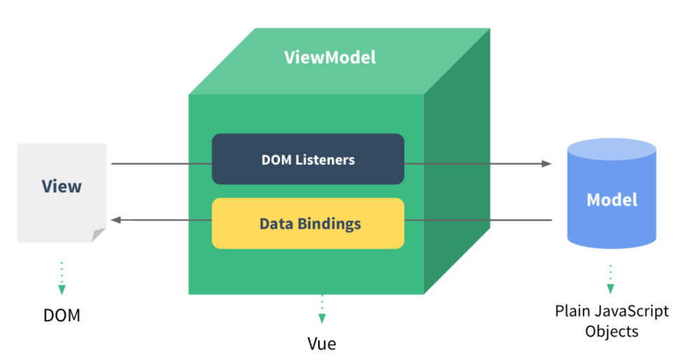

# Vue.js

1. Vue.js를 공부해야 하는 이유
2. 사전 준비
3. 강의 판교

# Vue 소개

1. MVVM 모델에서의 Vue

**Vue는 무엇인가**

컨트롤러대신 뷰 모델을 가지는 MVVM(Model-View-ViewModel) 패턴을 기반으로 디자인 되었으며. 재사용이 가능 한 UI들을 묶어서 사용

- MVVM: Mode - View - ViewModel의 줄임말로 로직과 UI의 분리를 위해 설계된 패턴
  

웹 페이지는 돔과 자바스크립트로 만들어지게 되는데 돔이 view역할을 하고, 자바스크립트가 Model 역할을 한다.<br>
뷰 모델이 없는 경우에는 직접 모델과 뷰를 연결해야한다.<br>
그러나 뷰 모델이 중간에 연결해 주는 것이 MVVM모델

MVVM 패턴의 뷰모델 레이어에 해당하는 화면 단 라이브러리

### Vue의 특징

- MVVM 패턴을 사용
- Virtual DOM의 사용
- Angular, React에 비해 매우 작고, 가벼우며 복잡도가 낮다.
- Template와 Component를 사용하여 재사용이 가능한 사용자 인터페이스를 묶고 view Layer를 정리하여 사용


2. Reactivity 구현

```vue

<div id="app"></div>
<script>
var div = document.querySelector('#app');
var viewModel = {};

// 객체의 동작을 재정의
// Object.defineProperty(대상 객체, 객체의 속성, {정의할 내용})
Object.defineProperty(viewModel, 'str', {
  // 속성에 접근했을 때의 동작을 정의
  get: function () {
    console.log('접근');
  },
  // 속성에 값을 할당했을 때의 동작을 의미
  set: function (newValue) {
    console.log('할당', newValue);
    render(newValue);
  }
})
</script>
```

3. Reactivity 코드 라이브러리화 하기

```vue
(fucntion() { // 즉시 실행 함수
function init() {
// 객체의 동작을 재정의
// Object.defineProperty(대상 객체, 객체의 속성, {정의할 내용})
Object.defineProperty(viewModel, 'str', {
// 속성에 접근했을 때의 동작을 정의
get: function() {
console.log('접근');
},
// 속성에 값을 할당했을 때의 동작을 정의
set: function(newValue) {
console.log('할당', newValue);
render(newValue);
}
});
}

function render(value) {
div.innerHTML = value;
}

init();
})();    
```

# Vue.js 인스턴스

1. 인스턴스 소개

new Vue로 선언하여 만들어진 객체로, 뷰로 개발할 때 필수로 생성해야 하는 코드이다.

```vue
new Vue();
```


2. 인스턴스와 생성자 함수

기본적인 생성자 함수의 개념<br>
<br>
매번 함수를 정의하는 게 아니라, 생성자 함수로 vue에서 api와 속성들을 정의해 놓고 갔다 쓰거나 재사용하는것
<br>=> new vue를 사용하는 이유
<br>

<br>

3. 인스턴스 옵션 속성
   <br>
   el: 태그에 지정한 ID, 클래스명, 태그명으로 해당 태그와 vue 인스턴스를 연겨하는 옵션

```vue
var vm = new Vue({
el: '#app' // element 지정해야 vue를 사용할 수 있음.
});
```

<br>
data: key와 value를 지정하는 json형식으로 데이터 입력 옵션
<br>
computed: getter/setter를 지정하는 옵션
과 같은 많은 기능이 존재

```vue
var vm = new Vue({
el: '#app',
data: {
message: 'hi'
},
methods: {
}
});
```

# Vue.js 컴포넌트

1. 컴포넌트 소개
   <br>
   화면에 비춰지는 뷰의 단위를 쪼개어 `재활용이 가능한 형태`로 관리하는 것이 컴포넌트이다.
   <br>
   vue는 재사용이 가능한 컴포넌트로 웹 페이지를 구성할 수 있따.
   <br>
   확장자가 .vue인 단일 파일에 HTML, 자바스크립트, css코드로 구성하여 사용

2. 컴포넌트 등록 실습

```vue
Vue.compoenet('컴포넌트 이름', '컴포넌트 내용');
```

- 전역 컴포넌트 등록: 실무에서 전역 컴포넌트는 거의 쓰이지 않지만 일단 이해를 위해 학습

  ```vue
    <div id="app">
    <app-header></app-header>
    <app-content></app-content>
    </div>
    
    <script>
    // 전역 컴포넌트
    // Vue.component('컴포넌트 이름', '컴포넌트 내용');
    Vue.component('app-header', {
      template: '<h1>Header</h1>'
    });
    Vue.component('app-content', {
      template: '<div>Content</div>'
    });
    
    new Vue({
      el: '#app'
    });
    </script>
  ```
  
- 지역 컴포넌트 등록
    ```vue
     <div id="app">
    <app-footer></app-footer>
    </div>
    
    <script>
    new Vue({
      el: '#app',
      components: {
        // 지역 컴포넌트 등록 방식
        //'키': '값'
        //'컴포넌트 이름': 컴포넌트 내용
        'app-footer': {
          template: '<footer>footer</footer>'
        }
      }
    });
    </script>
    ```

3. 컴포넌트와 인스턴스와의 관계
   : 새로운 인스턴스를 하나 생성

    ```vue
     <div id="app">
            <app-header></app-header>
            <app-footer></app-footer>
        </div>
        <div id="app2">
            <app-header></app-header>
            <app-footer></app-footer>
        </div>
    
        <script>
            // 전역 컴포넌트
            // Vue.component('컴포넌트 이름', '컴포넌트 내용');
            Vue.component('app-header', {
                template: '<h1>Header</h1>'
            });
        
            new Vue({
                el: '#app',
                components: {
                    // 지역 컴포넌트 등록 방식
                    //'키': '값'
                    //'컴포넌트 이름': 컴포넌트 내용
                    'app-footer': {
                        template: '<footer>footer</footer>'
                    }
                }
            });
    
            new Vue({
                el: '#app2'
            });
        </script>
    ```
   
    - 전역 컴포넌트는 바로 등록 되지만, 지역 컴포넌트는 인스턴스를 생성할 때마다 코드를 작성해서 등록