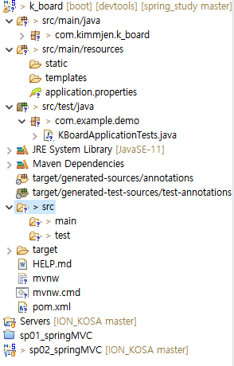

# spring boot
- spring boot devtools
- lombok
- spring configuration processor
- spring data jpa
- mybatis framework
- mysql driver
- thymeleaf
- spring web

[개념](https://congsong.tistory.com/13?category=749196)
## src/main/java 디렉터리
클래스, 인터페이스 등 자바 파일이 위치하는 디렉터리

